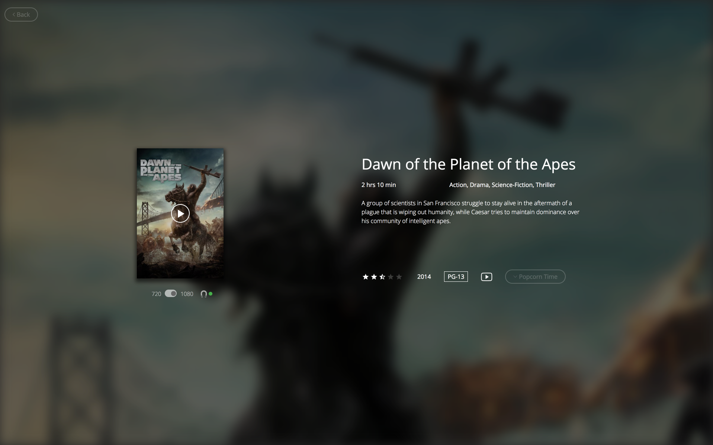
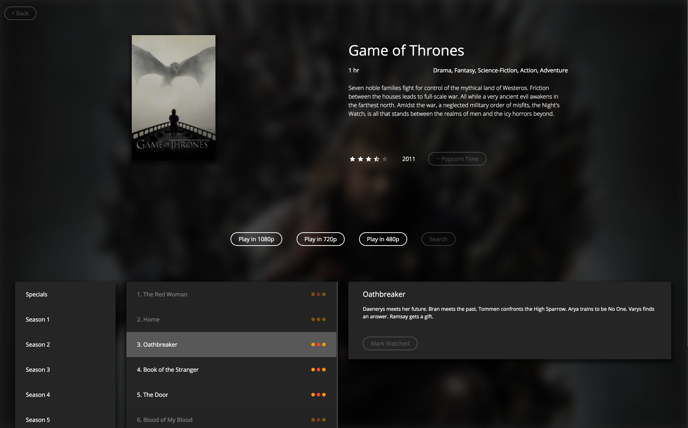

<h1 align="center">
  
  <br />
  Popcorn Time
</h1>

<h3 align="center">A Modern and Experimental Popcorn Time Client</h3>

<div align="center">
  <a target="_blank" href="https://travis-ci.org/TriPSs/popcorn-time-desktop/">
    
  </a>
  <a target="_blank" href="https://ci.appveyor.com/project/tripss/popcorn-time-desktop/branch/master">
    
  </a>
  <a target="_blank" href="https://david-dm.org/tripss/popcorn-time-desktop" title="dependencies status">
  	
  </a>
  <a target="_blank" href="https://david-dm.org/tripss/popcorn-time-desktop?type=dev" title="devDependencies status">
    
  </a>
  <a target="_blank" href="https://gitter.im/popcorn-time-desktop/Lobby?utm_source=badge&utm_medium=badge&utm_campaign=pr-badge&utm_content=badge">
    
  </a>
  <a target="_blank" href="https://github.com/tripss/popcorn-time-desktop/pulls">
    
  </a>
</div>

<br />

## Features:

**Modern**: This client was started from scratch and was designed to be performant and customizable

**Performance**: Significantly faster than other clients. Everything from scrolling perf to playing movies is buttery smooth

**Faster Torrents**: New API optimized for fast torrents by querying the from multiple endpoints

**Auto Torrents Search**: Search automatically for missing torrents on shows

**Modern Stack**: Electron, React, Redux, Webpack, ES7, Flow, and others

## Requirements:

* [Node >= 8](https://nodejs.org)
* Mac, Linux, Windows
* For packaging, see [packaging requirements](https://github.com/amilajack/popcorn-time-desktop/wiki/Packaging-Requirements)

## Getting started:
- **I am a tester:** Download the latest build from the [releases](https://github.com/tripss/popcorn-time-desktop/releases) section.

- **I am a developer:** Compile the project with the installation steps below.

## Installation:
```bash
git clone https://github.com/tripss/popcorn-time-desktop.git
cd popcorn-time-desktop

# Install dependencies
# Have a cup of coffee ☕️ this might take a while
# Run `npm run electron-rebuild` if get a 'module version mismatch' error
npm install

# Developement build
npm run start:dev

# Production build
npm run package
```

## Contributing:
Please see the [contributing guide](https://github.com/tripss/popcorn-time-desktop/blob/master/CONTRIBUTING.md)

## Todos:
See the [milestones](https://github.com/TriPSs/popcorn-time-desktop/milestones) for the full list.

## Screenshots

### Home Page:


### Movie Page:


### Show page:

